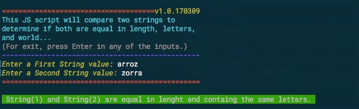

# Strings-Compare

The strcomp.js (JS) and strcomp.py (Python2 and Python3) scripts compare if two user input strings are the same string, are equal in length and have the same letters, or are different strings.

 Figure 1: ScreenShot strcomp.js
